# big math

**_This package provides mathematical functions that are not provided by the math/big package._**

## How is computed the _logarithm_ of a number ?

It's not that difficult since we have the [`Log10` function provided by the math package](https://pkg.go.dev/math#Log10). So we just have to convert the big number into a `float64` (type input required by [`Log10`](https://pkg.go.dev/math#Log10)), and we're good.

But if an _overflow_ happens, it's bad!

So we check if the number is _too big_ to be converted into a `float64`.
If so, we know that:

So we can do:

(let x be a big number) 
By computing the square root of _x_ (with the [`Sqrt` function provided by the math/big package](https://pkg.go.dev/math/big)), that value will be smaller () and may not cause an _overflow_. 
If it doesn't _overflow_, by _adding_ the _logarithm_ of this value with itself (), we can compute the _logarithm_ of the big number. 
Now if  still _overflows_, we just have to compute . In other terms we get the _fourth root_. So to get , we have to multiply . 
And if  is still too big, we continue the same process by computing its square root, and multiply it by _8_.
So the general formula is:

(n ∈ N being the number of times we've computed the square root of the previous square root until we found a decent value that doesn't _overflow_. Meaning when  <= `max number before overflow`)

## Limitations of `Log10` (`IntLog10`, `FloatLog10`, `RatLog10`)

The largest number a `float64` (output type of `Log10`) can handle before _overflowing_ is 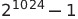 (see [math.MaxFloat64](https://pkg.go.dev/math#MaxFloat64)). 
And we know that 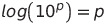. 
With that, we can conclude that the **biggest** number we can compute its _logarithm_ is 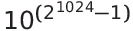.

Also, the variable that can _overflows_ before reaching  is 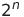 (which is of type `int64` and therefore can handle up to 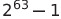). 
We can know the **largest** number that can be computed before causing an _overflow_ to this value () by resolving this inequation: 
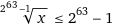 for `IntLog10` (max value of `int64`: ) 
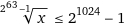 for `FloatLog10` and `RatLog10` (max value of `float64`: )

So for `IntLog10`: 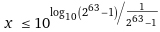 or 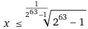

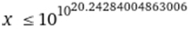

And for `FloatLog10`/`RatLog10`: 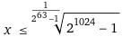

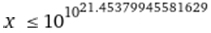
